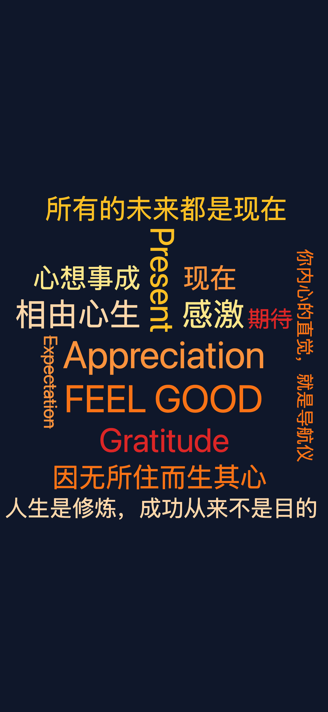

# WordCloud Wallpaper Generator

A browser-based tool to create personalised word cloud wallpapers. Add words with weights, customise the look, and export at any screen resolution — no installation or internet connection required.

Use it now: [wordcloud-wallpaper.pages.dev](https://wordcloud-wallpaper.pages.dev/)



## Features

- **Word input** — type any word, set a weight (1–10) to control its size in the cloud
- **Strikethrough mode** — mark words you want to avoid; they appear crossed out in the cloud as a visual reminder
- **Classic spiral layout** — words are placed using an Archimedean spiral from the centre outward, with bounding-box collision detection
- **Word rotation** — optionally allow words to appear at 90° for a denser, more dynamic layout
- **6 colour palettes** — Ocean, Sunset, Forest, Neon, Mono, Pastel
- **Background colour picker** — full control over the canvas background
- **5 font styles** — Sans-serif, Serif, Monospace, Rounded, Display
- **9 export resolutions** — Desktop HD/QHD/4K, MacBook Air/Pro, iPhone 14/Pro Max, Android standard/QHD
- **One-click PNG download** — renders at full target resolution off-screen before saving

## Usage

1. Open `src/index.html` in any modern browser (Chrome, Firefox, Safari, Edge)
2. Type a word in the input field and set its weight with the slider
3. Optionally tick **Strikethrough** to mark the word as something to avoid
4. Click **Add Word** (or press Enter) — the preview updates instantly
5. Adjust the palette, background, font, and rotation settings in the sidebar
6. Select an export resolution from the dropdown
7. Click **Download Wallpaper** to save a full-resolution PNG

## Export Sizes

| Category          | Size         |
| ----------------- | ------------ |
| Desktop HD        | 1920 × 1080 |
| Desktop QHD       | 2560 × 1440 |
| Desktop 4K        | 3840 × 2160 |
| MacBook Air       | 2560 × 1600 |
| MacBook Pro       | 3024 × 1964 |
| iPhone 14         | 1170 × 2532 |
| iPhone 14 Pro Max | 1290 × 2796 |
| Android           | 1080 × 2400 |
| Android QHD       | 1440 × 3200 |

## Tech Stack

- Pure HTML, CSS, and JavaScript — zero dependencies, zero build step
- Canvas 2D API for rendering and export
- Single file: `src/index.html`

## Project Structure

```
wordcloud-wallpaper/
├── src/
│   └── index.html   # The entire application
├── idea.md          # Original product brief
└── README.md
```
